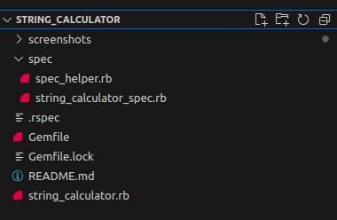
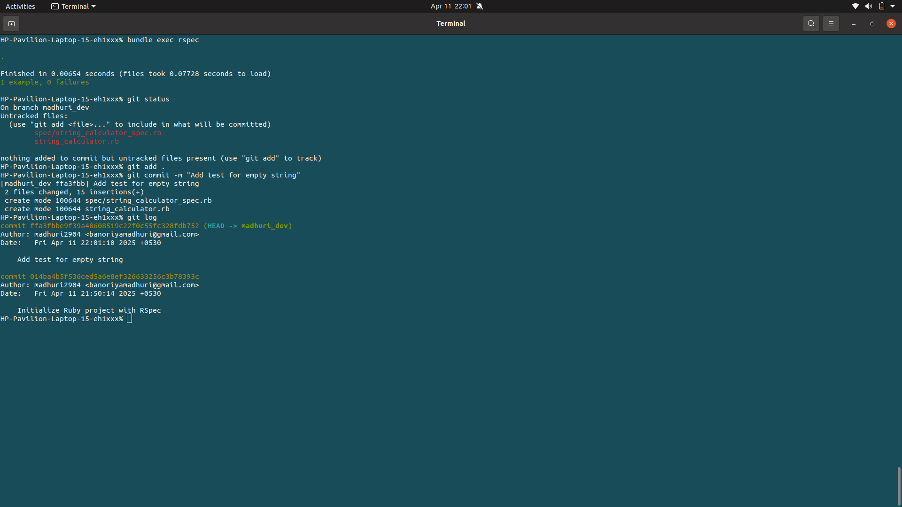
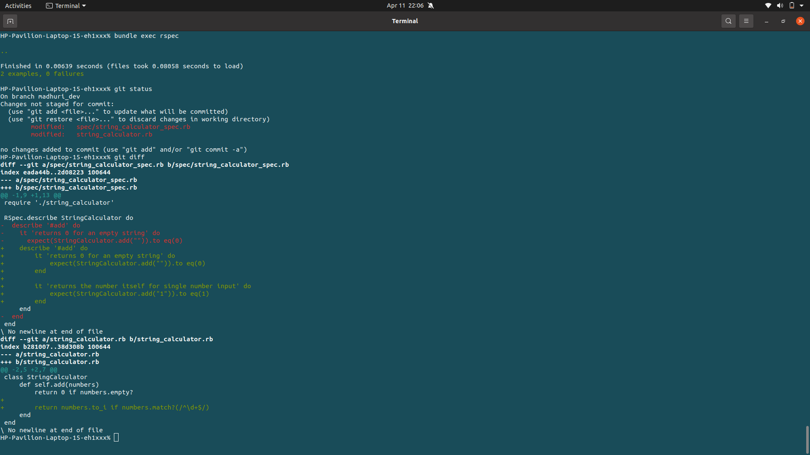
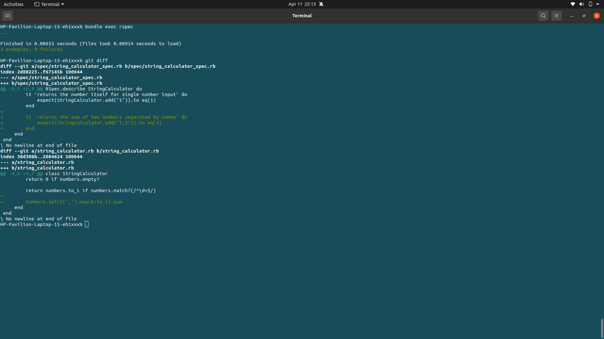
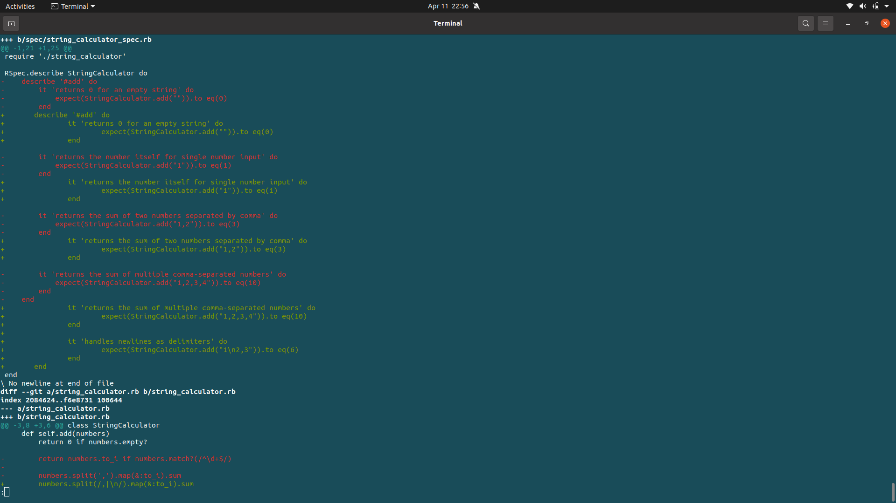
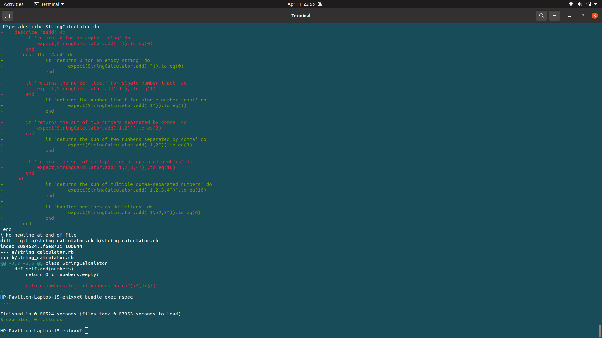
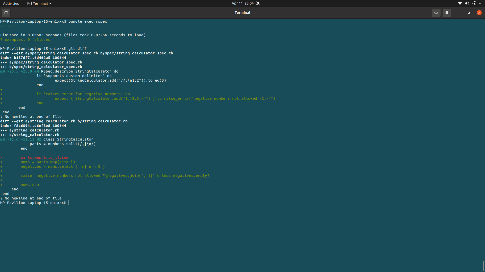
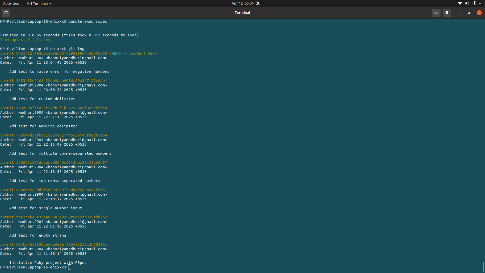

# String Calculator – TDD Kata

This project is a solution to the [String Calculator TDD Kata](https://github.com/madhuri2904/stringcalulator.git) built with Ruby and RSpec. It demonstrates Test-Driven Development (TDD) best practices using clean and incremental commits.

---

## Setup Instructions

1. Clone the repository:
    ```bash
    git clone https://github.com/madhuri2904/stringcalulator.git
    cd string_calculator
    ```

2. Install dependencies:
    ```bash
    bundle install
    ```

3. Run tests:
    ```bash
    bundle exec rspec
    ```

## Features Implemented

- Return 0 for an empty string
- Return the number itself for a single input
- Return the sum of two or more comma-separated numbers
- Handle newlines (`\n`) as delimiters

---

## Screenshots

### 1. Folder Structure


### 2. Test Results
![Test Results]
1. 
2. 
3. 
4. 
5. 
6. 
7. 


---

## Next Features (Coming Soon)

- Custom delimiters (e.g., `//;\n1;2`)
- Exception handling for negative numbers

---

## Author

**Madhuri Banoriya**

Ruby on Rails Developer

---
